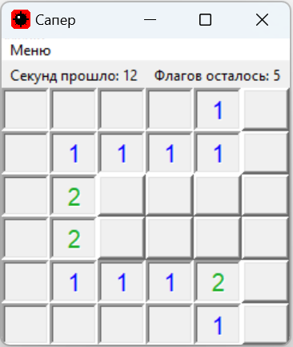

# MineSweeper Tkinter in Python
> MineSweeper game written in Python using Tkinter GUI library.



Contents:
----------

- *MineSweeper.py* - The actual python program
- *images* - Images ready for usage with Tkinter

### Requirements:
In order to install this package, you need to install

- `Pillow`
  
__From PyPI (the latest stable version)__

```bash
pip install Pillow
```
